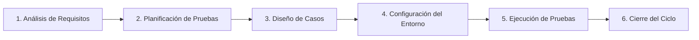

## Universidad Internacional del Ecuador
## Taller en Clase - Caja Negra
#### 7 de Septiembre del 2026
## Docente
#### Pablo Robayo
## Integrantes 
#### Gonzalo Cárdenas - Documentación y GitHub
#### Gabriel Vásquez - Tester Principal
#### Daniel Cadena - Desarrollador / Analista 

Desafío Lógico 1
Según lo investigado en ISTQB, ¿es posible que
un Defecto (Bug) exista en el código fuente de
presupuesto_analisis.py durante años sin
llegar a causar nunca un Fallo (Failure)?

-Sí, porque un defecto es una imperfección presente en el código, mientras que un fallo ocurre durante la ejecución cuando el sistema presenta un comportamiento diferente al esperado.
 Además, un bug puede permanecer oculto indefinidamente si los usuarios siempre ingresan datos ideales que no detonen el fallo.

Desafío Lógico 2
Imaginen que corrigen todos los bugs y el script
funciona perfecto, pero el cliente afirma que
"necesitaba un sistema para calcular nóminas, no
presupuestos". ¿Qué principio fundamental del
testing de ISTQB se acaba de violar aunque el
código esté limpio?

-El principio que se esta violando es el de la falacia de la ausencia de errores, el cual indica que encontrar y corregir defectos no ayuda si el sistema construido es inutilizable y no cumple con las necesidades y expectativas de los usuarios y del negocio.


## Check-list de Autoevaluación Final

Auditoría previa a la entrega final del taller:

- [x] **¿El repositorio de GitHub es estrictamente público?**  
  *Sí, configurado para acceso público sin restricciones.*
- [x] **¿Contiene el archivo `presupuesto_analisis.py` tal como fue entregado?**  
  *Sí, conservado íntegro con los 3 defectos originales para trazabilidad de pruebas.*
- [x] **¿Contiene el archivo `casos_prueba.md`?**  
  *Sí, con estructura completa de gobernanza, pruebas y diagnóstico.*
- [x] **¿El Markdown incluye evidencia (diagrama/enlace) del mapa conceptual?**  
  *Sí, diagrama formal en Mermaid y conexiones explicadas en detalle.*
- [x] **¿La tabla tiene los 3 casos ejecutados, con columna Estado y líneas de código defectuosas señaladas?**  
  *Sí, CP-01, CP-02 y CP-03 documentados con veredicto `Failed` y causa raíz identificada.*
- [x] **¿El `README.md` contiene las respuestas a los dos desafíos del cierre?**  
  *Sí, Desafíos Lógicos 1 y 2 resueltos con fundamentos técnicos formales de ISTQB.*
- [x] **¿Todos los miembros del equipo participaron y observaron cada actividad, sin importar el rol asignado?**  
  *Sí, dinámica de célula operativa QA completa de inicio a fin.*

---

# Automatización de Pruebas con PyTest y GitHub Actions


##  Conceptos Clave 

### 6.1. Software Testing Life Cycle (STLC)
El **STLC (Ciclo de Vida de las Pruebas de Software)** es un proceso formal, sistemático y estructurado de actividades de aseguramiento de calidad diseñado para garantizar que el producto software satisfaga los requisitos especificados y esté libre de defectos críticos. Se compone de 6 fases secuenciales e interconectadas:



1. **Análisis de Requisitos (Requirement Analysis):**
   - El equipo de QA examina las especificaciones funcionales y no funcionales para identificar qué debe probarse y determinar si los requisitos son verificables y medibles.
   - *Entregable:* Matriz de Trazabilidad de Requisitos (RTM) y lista de dudas / ambigüedades.
2. **Planificación de Pruebas (Test Planning):**
   - El líder de QA define la estrategia global de pruebas, alcance, estimación de esfuerzo, recursos requeridos, herramientas (como PyTest y GitHub Actions) y cronograma.
   - *Entregable:* Plan de Pruebas (Test Plan) y análisis de riesgos.
3. **Diseño y Desarrollo de Casos de Prueba (Test Case Development):**
   - Se crean casos de prueba detallados con sus identificadores (ej. CP-01, CP-02, CP-03), precondiciones, datos de entrada, pasos detallados y resultados esperados. Se preparan también los scripts automatizados.
   - *Entregable:* Casos de prueba documentados y scripts de prueba automatizados.
4. **Configuración del Entorno de Pruebas (Test Environment Setup):**
   - Se aprovisiona el hardware, software, dependencias y redes donde se ejecutarán las pruebas. En CI/CD moderno, esta fase se virtualiza mediante runners automáticos (ej. Ubuntu en GitHub Actions).
   - *Entregable:* Entorno listo con datos de prueba cargados.
5. **Ejecución de Pruebas (Test Execution):**
   - Se ejecutan los casos de prueba manuales y automatizados. Los resultados obtenidos se comparan con los esperados. Las discrepancias se reportan como defectos (bugs).
   - *Entregable:* Registro de ejecución y reportes de defectos.
6. **Cierre del Ciclo de Pruebas (Test Cycle Closure):**
   - Tras validar las correcciones y cumplir los criterios de salida, el equipo evalúa la cobertura, métricas de defectos, lecciones aprendidas y firma formalmente el cierre de la versión.
   - *Entregable:* Reporte de Cierre de Pruebas (Test Summary Report).

---

### 6.2. SDLC vs. STLC

Son dos perspectivas complementarias:

| Dimensión | SDLC (Software Development Life Cycle) | STLC (Software Testing Life Cycle) |
| :--- | :--- | :--- |
| **Enfoque Principal** | Creación y construcción del producto de software. | Validación, verificación y aseguramiento de la calidad del producto. |
| **Objetivo** | Entregar un sistema de software funcional que resuelva una necesidad del usuario. | Detectar defectos, evaluar riesgos y certificar que el sistema cumple los requisitos. |
| **Inicio** | Inicia desde la concepción del proyecto con la toma de requerimientos de negocio. | Inicia en cuanto los requerimientos están disponibles para ser revisados por QA. |
| **Fases Clave** | Requisitos -> Diseño -> Codificación -> Pruebas -> Despliegue -> Mantenimiento. | Análisis de requisitos -> Planificación -> Diseño -> Entorno -> Ejecución -> Cierre. |
| **Responsables** | Analistas, Arquitectos de Software, Desarrolladores. | Ingenieros de Calidad (QA), Testers, Automatizadores (SDET). |
| **Sincronía** | Define las etapas evolutivas de construcción. | **Corre en paralelo** dentro de cada etapa del SDLC para verificar el entregable correspondiente. |


---

### 6.3. Shift-Left Testing (Pruebas Tempranas)

El principio de **Shift-Left Testing** es una filosofía de ingeniería de calidad que postula mover las actividades de prueba lo más hacia la "izquierda" posible en la línea de tiempo del ciclo de desarrollo (es decir, hacia las fases iniciales de requisitos, diseño y codificación).

```
   [Izquierda / Temprano]                                      [Derecha / Tardío]
Requisitos  ->  Diseño  ->  Codificación (CI)  ->  Staging  ->  Producción
     ▲                        ▲
     │                        │
  Revisión QA           Pruebas Unitarias
  Estática              PyTest Automáticas
```


###  Criterios de Entrada y Salida (Entry & Exit Criteria)

Para evitar la ambigüedad y garantizar la rigurosidad en los procesos de calidad, el estándar ISTQB define dos puntos de control indispensables:

#### A. Criterios de Entrada (*Entry Criteria*):
Son el conjunto de prerrequisitos formales y condiciones mínimas indispensables que deben satisfacerse antes de poder dar inicio a una fase específica de pruebas. Su propósito es impedir que el equipo malgaste tiempo intentando probar software que no está listo.


#### B. Criterios de Salida (*Exit Criteria* o *Definition of Done - DoD*):
Son el conjunto de métricas verificables, condiciones y resultados objetivos acordados previamente que determinan cuándo una fase de pruebas o un ciclo completo se puede dar por concluido con éxito.


