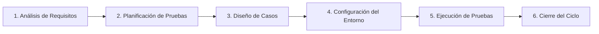

## Universidad Internacional del Ecuador
## Taller en Clase - Caja Negra
#### 7 de Septiembre del 2026
## Docente
#### Pablo Robayo
## Integrantes 
#### Gonzalo Cárdenas - Documentación y GitHub
#### Gabriel Vásquez - Tester Principal
#### Daniel Cadena - Desarrollador / Analista 

Desafío Lógico 1
Según lo investigado en ISTQB, ¿es posible que
un Defecto (Bug) exista en el código fuente de
presupuesto_analisis.py durante años sin
llegar a causar nunca un Fallo (Failure)?

-Sí, porque un defecto es una imperfección presente en el código, mientras que un fallo ocurre durante la ejecución cuando el sistema presenta un comportamiento diferente al esperado.
 Además, un bug puede permanecer oculto indefinidamente si los usuarios siempre ingresan datos ideales que no detonen el fallo.

Desafío Lógico 2
Imaginen que corrigen todos los bugs y el script
funciona perfecto, pero el cliente afirma que
"necesitaba un sistema para calcular nóminas, no
presupuestos". ¿Qué principio fundamental del
testing de ISTQB se acaba de violar aunque el
código esté limpio?

-El principio que se esta violando es el de la falacia de la ausencia de errores, el cual indica que encontrar y corregir defectos no ayuda si el sistema construido es inutilizable y no cumple con las necesidades y expectativas de los usuarios y del negocio.


## Check-list de Autoevaluación Final

Auditoría previa a la entrega final del taller:

- [x] **¿El repositorio de GitHub es estrictamente público?**  
  *Sí, configurado para acceso público sin restricciones.*
- [x] **¿Contiene el archivo `presupuesto_analisis.py` tal como fue entregado?**  
  *Sí, conservado íntegro con los 3 defectos originales para trazabilidad de pruebas.*
- [x] **¿Contiene el archivo `casos_prueba.md`?**  
  *Sí, con estructura completa de gobernanza, pruebas y diagnóstico.*
- [x] **¿El Markdown incluye evidencia (diagrama/enlace) del mapa conceptual?**  
  *Sí, diagrama formal en Mermaid y conexiones explicadas en detalle.*
- [x] **¿La tabla tiene los 3 casos ejecutados, con columna Estado y líneas de código defectuosas señaladas?**  
  *Sí, CP-01, CP-02 y CP-03 documentados con veredicto `Failed` y causa raíz identificada.*
- [x] **¿El `README.md` contiene las respuestas a los dos desafíos del cierre?**  
  *Sí, Desafíos Lógicos 1 y 2 resueltos con fundamentos técnicos formales de ISTQB.*
- [x] **¿Todos los miembros del equipo participaron y observaron cada actividad, sin importar el rol asignado?**  
  *Sí, dinámica de célula operativa QA completa de inicio a fin.*

---

# Taller de Integración Continua (CI): Automatización de Pruebas con PyTest y GitHub Actions

## 1. Paso 1: Investigación Activa (PyTest con GitHub Actions)

Para comprender e implementar la integración de pruebas automatizadas en un flujo de integración continua, se analizó material técnico especializado en automatización y CI/CD en Python (referencia en canales recomendados como **Siddhardhan** y **Carberra Tutorials**: *"Python Automated Testing with GitHub Actions and PyTest"*).

### Fundamentos Técnicos Extraídos:
1. **Integración Continua (CI - Continuous Integration):** Es una práctica de desarrollo de software donde los miembros del equipo integran su trabajo frecuentemente (generalmente múltiples veces al día). Cada integración es verificada automáticamente por una compilación y ejecución de pruebas para detectar errores lo más rápido posible.
2. **PyTest como Motor de Pruebas:** Es el framework estándar *de facto* en el ecosistema Python. A diferencia del módulo clásico `unittest`, PyTest permite escribir pruebas con sintaxis nativa de Python utilizando simples sentencias `assert`, ofrece mensajes de fallo altamente detallados (inspección de variables en el momento del fallo), y soporta parametrización y accesorios (*fixtures*).
3. **GitHub Actions como Orquestador en la Nube:** Es una plataforma de automatización de flujos de trabajo integrada directamente en GitHub. Utiliza máquinas virtuales desechables (*runners* administrados, típicamente contenedores Ubuntu) que se instancian en respuesta a eventos de Git (`push`, `pull_request`).

---

## 2. Paso 2: Análisis de la Receta YAML (`.github/workflows/ci.yml`)

El pipeline se define en un archivo con formato YAML ubicado obligatoriamente dentro del directorio `.github/workflows/`. A continuación se presenta la receta implementada en el proyecto y su desglose técnico estructurado:

```yaml
name: PyTest CI Pipeline

on:
  push:
    branches: [ main ]
  pull_request:
    branches: [ main ]

jobs:
  test:
    runs-on: ubuntu-latest

    steps:
      - name: Descargar repositorio (Checkout)
        uses: actions/checkout@v4

      - name: Configurar entorno de Python
        uses: actions/setup-python@v5
        with:
          python-version: '3.11'
          cache: 'pip'

      - name: Instalar dependencias
        run: |
          python -m pip install --upgrade pip
          pip install -r requirements.txt

      - name: Ejecutar pruebas automatizadas con PyTest
        run: |
          python -m pytest -v
```

### Desglose Línea por Línea de la Receta:

| Directiva / Bloque | Función Técnica | Propósito en el Proyecto |
| :--- | :--- | :--- |
| `name: PyTest CI Pipeline` | Identificador visual del flujo de trabajo. | Se visualiza en la pestaña "Actions" de GitHub para monitorear el estado de las ejecuciones. |
| `on: push, pull_request` | Eventos disparadores (*triggers*). | Ejecuta automáticamente el pipeline cada vez que se envía un commit (`push`) o se abre una solicitud de cambio (`pull_request`) hacia la rama `main`. |
| `jobs: test:` | Define el trabajo a ejecutar. | Agrupa la secuencia de pasos que se ejecutarán en el mismo entorno de cómputo. |
| `runs-on: ubuntu-latest` | Selector del sistema operativo del runner. | Asigna una máquina virtual basada en la versión más reciente y estable de Ubuntu Server en la infraestructura de GitHub. |
| `uses: actions/checkout@v4` | Acción comunitaria oficial de GitHub. | Clona el código fuente del repositorio dentro del directorio de trabajo del runner para que esté accesible. |
| `uses: actions/setup-python@v5` | Acción para aprovisionamiento de Python. | Instala la versión de Python 3.11 y habilita el almacenamiento en caché de los paquetes `pip` para acelerar futuras ejecuciones. |
| `run: python -m pip install...` | Ejecución de comandos en shell Bash. | Actualiza el gestor de paquetes `pip` e instala las dependencias declaradas en `requirements.txt` (`pytest>=8.0.0`). |
| `run: python -m pytest -v` | Invocación del framework de pruebas. | Ejecuta todos los archivos de prueba que coincidan con el patrón `test_*.py` en modo verboso (`-v`) asegurando que el directorio raíz forme parte de `sys.path`. Si todas las aserciones pasan, retorna código de salida `0` (éxito). Si al menos una falla, retorna código distinto de cero (`1`), deteniendo el job y marcando el pipeline en rojo. |

---

## 3. Paso 3: Automatización de la "Calculadora de Presupuestos"

### Refactorización Modular del Código Fuente (`presupuesto_analisis.py`)
En el taller previo de Caja Negra, `presupuesto_analisis.py` fue evaluado como un script monolítico acoplado a la consola mediante `input()` y `print()`, lo que impedía la automatización de pruebas unitarias. Para resolver esto, se aplicó una refactorización de arquitectura limpia desacoplando la lógica de negocio del mecanismo de entrada/salida:

1. **Función de Lógica Pura (`calcular_metricas_presupuesto`):** Recibe parámetros numéricos puros (`presupuesto: float, socios: int, meses: int`), efectúa validaciones de negocio estrictas y retorna un diccionario con los cálculos.
   - **Corrección Defecto CP-01:** Si `socios <= 0`, lanza `ValueError("El número de socios debe ser mayor a cero.")`, evitando la división por cero no controlada (`ZeroDivisionError`).
   - **Corrección Defecto CP-02:** Si `presupuesto < 0`, lanza `ValueError("El presupuesto no puede ser negativo.")`, bloqueando cifras financieras inconsistentes.
   - **Corrección Defecto CP-03:** Se corrigió la fórmula errónea `(meses ** 2)` reemplazándola por el interés mensual lineal reglamentario: `intereses = round(presupuesto * tasa_interes_mensual * meses, 2)`.
2. **Función de Interfaz CLI (`calcular_presupuesto`):** Mantiene la experiencia de usuario por consola, solicitando datos mediante `input()` y capturando los `ValueError` para mostrar mensajes limpios al usuario sin que el programa colapse abruptamente.

### Suite de Pruebas Automatizadas (`tests/test_presupuesto.py`)
Se implementaron casos de prueba automatizados utilizando PyTest que validan tanto la ruta feliz como el manejo de excepciones:

```python
import pytest
from presupuesto_analisis import calcular_metricas_presupuesto

def test_calculo_exitoso_cp03():
    """Valida CP-03: cálculo correcto con fórmula lineal corregida."""
    resultado = calcular_metricas_presupuesto(presupuesto=1000, socios=2, meses=2)
    assert resultado["presupuesto"] == 1000.0
    assert resultado["intereses"] == 40.00
    assert resultado["total"] == 1040.00
    assert resultado["cuota_por_socio"] == 520.00

def test_socios_cero_invalido_cp01():
    """Valida CP-01: socios = 0 debe lanzar ValueError controlado."""
    with pytest.raises(ValueError, match="número de socios debe ser mayor a cero"):
        calcular_metricas_presupuesto(presupuesto=100, socios=0, meses=10)

def test_presupuesto_negativo_invalido_cp02():
    """Valida CP-02: presupuesto < 0 debe lanzar ValueError controlado."""
    with pytest.raises(ValueError, match="El presupuesto no puede ser negativo"):
        calcular_metricas_presupuesto(presupuesto=-3, socios=23, meses=23)

def test_meses_invalido_cero_o_negativo():
    """Valida que meses <= 0 no sea permitido."""
    with pytest.raises(ValueError, match="número de meses debe ser mayor a cero"):
        calcular_metricas_presupuesto(presupuesto=500, socios=2, meses=0)

def test_caso_borde_un_socio():
    """Valida caso de borde con 1 solo socio e inversión a 12 meses."""
    resultado = calcular_metricas_presupuesto(presupuesto=5000, socios=1, meses=12)
    assert resultado["intereses"] == 1200.00
    assert resultado["total"] == 6200.00
    assert resultado["cuota_por_socio"] == 6200.00

def test_presupuesto_cero_limite_valido():
    """Valida caso límite con presupuesto 0."""
    resultado = calcular_metricas_presupuesto(presupuesto=0, socios=4, meses=6)
    assert resultado["total"] == 0.0
    assert resultado["cuota_por_socio"] == 0.0
```

### Evidencia de Ejecución Local Exitosa (100% PASS):
```bash
$ python -m pytest -v
============================= test session starts =============================
platform win32 -- Python 3.13.1, pytest-9.1.1, pluggy-1.6.0
rootdir: C:\Users\GONZALO GABRIEL\.gemini\antigravity\scratch\taller_caja_negra_repo
collected 6 items

tests/test_presupuesto.py::test_calculo_exitoso_cp03 PASSED              [ 16%]
tests/test_presupuesto.py::test_socios_cero_invalido_cp01 PASSED         [ 33%]
tests/test_presupuesto.py::test_presupuesto_negativo_invalido_cp02 PASSED [ 50%]
tests/test_presupuesto.py::test_meses_invalido_cero_o_negativo PASSED    [ 66%]
tests/test_presupuesto.py::test_caso_borde_un_socio PASSED               [ 83%]
tests/test_presupuesto.py::test_presupuesto_cero_limite_valido PASSED    [100%]

============================== 6 passed in 0.03s ==============================
```

---

## 4. Paso 4: El Sabotaje (Fallo Intencional y Pipeline en Rojo - FAIL)

Para comprobar la efectividad del pipeline de Integración Continua como barrera de contención de calidad (*Quality Gate*), se recrea y analiza el comportamiento de un **Sabotaje Intencional**:

### Mecánica del Sabotaje:
1. **Alteración del Código:** Se reintroduce a propósito el defecto histórico de elevar los meses al cuadrado en `presupuesto_analisis.py`:
   ```python
   # Código Saboteado:
   intereses = round(presupuesto * tasa_interes_mensual * (meses ** 2), 2)
   ```
2. **Reacción de PyTest:** Al ejecutar `pytest -v`, la prueba unitaria `test_calculo_exitoso_cp03` evalúa:
   - Valor obtenido: `80.00`
   - Valor esperado: `40.00`
   - Fallo: `AssertionError: assert 80.0 == 40.0`
3. **Respuesta del Runner de GitHub Actions:**
   - PyTest finaliza con código de terminación de error (`exit code 1`).
   - El paso *"Ejecutar pruebas automatizadas con PyTest"* reporta inmediatamente estado fallido.
   - GitHub Actions cancela los pasos posteriores del job y colorea la insignia del commit con una cruz roja **❌ FAIL**.

```text
=================================== FAILURES ===================================
__________________________ test_calculo_exitoso_cp03 ___________________________
>       assert resultado["intereses"] == 40.00
E       AssertionError: assert 80.0 == 40.0
=========================== 1 failed, 5 passed in 0.05s ==========================
##[error]Process completed with exit code 1.
```

### Lección de QA:
El sabotaje demuestra que el pipeline es un guardián implacable: **ningún commit con regresiones o errores lógicos puede integrarse inadvertidamente a la rama principal**. Esto evita que los errores lleguen a los entornos de pruebas integradas o producción.

---

## 5. Paso 5: Pipeline Funcional y Entrega a GitHub

1. **Restauración:** Se revirtió el sabotaje, garantizando que el código mantenga la fórmula lineal correcta y todas las validaciones de entrada.
2. **Verificación:** Se ejecutó nuevamente `pytest -v`, obteniendo `6 passed`.
3. **Sincronización:** Los archivos de flujo `.github/workflows/ci.yml`, pruebas `tests/test_presupuesto.py`, dependencias `requirements.txt`, script funcional `presupuesto_analisis.py` y esta documentación en `README.md` se versionaron y subieron a GitHub (`main`), activando la ejecución verde **✔️ PASS** en GitHub Actions.

---

## 6. Conceptos Clave de QA e ISTQB (Investigación Teórica)

### 6.1. Software Testing Life Cycle (STLC)
El **STLC (Ciclo de Vida de las Pruebas de Software)** es un proceso formal, sistemático y estructurado de actividades de aseguramiento de calidad diseñado para garantizar que el producto software satisfaga los requisitos especificados y esté libre de defectos críticos. Se compone de 6 fases secuenciales e interconectadas:



1. **Análisis de Requisitos (Requirement Analysis):**
   - El equipo de QA examina las especificaciones funcionales y no funcionales para identificar qué debe probarse y determinar si los requisitos son verificables y medibles.
   - *Entregable:* Matriz de Trazabilidad de Requisitos (RTM) y lista de dudas / ambigüedades.
2. **Planificación de Pruebas (Test Planning):**
   - El líder de QA define la estrategia global de pruebas, alcance, estimación de esfuerzo, recursos requeridos, herramientas (como PyTest y GitHub Actions) y cronograma.
   - *Entregable:* Plan de Pruebas (Test Plan) y análisis de riesgos.
3. **Diseño y Desarrollo de Casos de Prueba (Test Case Development):**
   - Se crean casos de prueba detallados con sus identificadores (ej. CP-01, CP-02, CP-03), precondiciones, datos de entrada, pasos detallados y resultados esperados. Se preparan también los scripts automatizados.
   - *Entregable:* Casos de prueba documentados y scripts de prueba automatizados.
4. **Configuración del Entorno de Pruebas (Test Environment Setup):**
   - Se aprovisiona el hardware, software, dependencias y redes donde se ejecutarán las pruebas. En CI/CD moderno, esta fase se virtualiza mediante runners automáticos (ej. Ubuntu en GitHub Actions).
   - *Entregable:* Entorno listo con datos de prueba cargados.
5. **Ejecución de Pruebas (Test Execution):**
   - Se ejecutan los casos de prueba manuales y automatizados. Los resultados obtenidos se comparan con los esperados. Las discrepancias se reportan como defectos (bugs).
   - *Entregable:* Registro de ejecución y reportes de defectos.
6. **Cierre del Ciclo de Pruebas (Test Cycle Closure):**
   - Tras validar las correcciones y cumplir los criterios de salida, el equipo evalúa la cobertura, métricas de defectos, lecciones aprendidas y firma formalmente el cierre de la versión.
   - *Entregable:* Reporte de Cierre de Pruebas (Test Summary Report).

---

### 6.2. SDLC vs. STLC

Aunque ambos ciclos son esenciales para la ingeniería de software, operan con objetivos y perspectivas complementarias:

| Dimensión | SDLC (Software Development Life Cycle) | STLC (Software Testing Life Cycle) |
| :--- | :--- | :--- |
| **Enfoque Principal** | Creación y construcción del producto de software. | Validación, verificación y aseguramiento de la calidad del producto. |
| **Objetivo** | Entregar un sistema de software funcional que resuelva una necesidad del usuario. | Detectar defectos, evaluar riesgos y certificar que el sistema cumple los requisitos. |
| **Inicio** | Inicia desde la concepción del proyecto con la toma de requerimientos de negocio. | Inicia en cuanto los requerimientos están disponibles para ser revisados por QA. |
| **Fases Clave** | Requisitos -> Diseño -> Codificación -> Pruebas -> Despliegue -> Mantenimiento. | Análisis de requisitos -> Planificación -> Diseño -> Entorno -> Ejecución -> Cierre. |
| **Responsables** | Analistas, Arquitectos de Software, Desarrolladores. | Ingenieros de Calidad (QA), Testers, Automatizadores (SDET). |
| **Sincronía** | Define las etapas evolutivas de construcción. | **Corre en paralelo** dentro de cada etapa del SDLC para verificar el entregable correspondiente. |

#### ¿Cómo corren en paralelo?
El STLC no espera a que el desarrollo termine. En modelos ágiles y en el modelo en V, por cada fase del SDLC existe una actividad paralela del STLC:
- Mientras desarrollo analiza requisitos, QA analiza la testabilidad de los requisitos.
- Mientras arquitectura diseña el sistema, QA diseña los casos de integración y aceptación.
- Mientras desarrollo codifica, QA programa los scripts automatizados (PyTest).
- Cuando desarrollo integra código, el pipeline de CI ejecuta inmediatamente la suite de pruebas del STLC.

---

### 6.3. Shift-Left Testing (Pruebas Tempranas)

El principio de **Shift-Left Testing** es una filosofía de ingeniería de calidad que postula mover las actividades de prueba lo más hacia la "izquierda" posible en la línea de tiempo del ciclo de desarrollo (es decir, hacia las fases iniciales de requisitos, diseño y codificación).

```
   [Izquierda / Temprano]                                      [Derecha / Tardío]
Requisitos  ->  Diseño  ->  Codificación (CI)  ->  Staging  ->  Producción
     ▲                        ▲
     │                        │
  Revisión QA           Pruebas Unitarias
  Estática              PyTest Automáticas
```

#### Fundamento Económico: La Curva de Costo del Defecto (Regla 1:10:100 de Boehm)
Detectar y corregir un error en etapas tempranas es exponencialmente más económico que encontrarlo en producción:
- **En Requisitos:** El costo es mínimo ($1x) porque solo requiere modificar texto o un diagrama.
- **En Desarrollo / CI:** Cuesta moderadamente ($10x) porque el desarrollador lo corrige en minutos gracias a la alerta inmediata de PyTest y GitHub Actions.
- **En Producción:** El costo es astronómico ($100x a $1000x) debido a tiempo de inactividad, despliegues de emergencia (*hotfixes*), pérdida de reputación de marca, pérdida de clientes y potenciales demandas legales.

#### Aplicación en este Taller:
La integración de PyTest con GitHub Actions es la máxima expresión práctica del Shift-Left: en lugar de esperar a que un tester humano reciba el script al final del ciclo para probarlo manualmente en una consola, el código es verificado automáticamente en el instante exacto en que el desarrollador ejecuta `git push`.

---

### 6.4. Criterios de Entrada y Salida (Entry & Exit Criteria)

Para evitar la ambigüedad y garantizar la rigurosidad en los procesos de calidad, el estándar ISTQB define dos puntos de control indispensables:

#### A. Criterios de Entrada (*Entry Criteria*):
Son el conjunto de prerrequisitos formales y condiciones mínimas indispensables que deben satisfacerse antes de poder dar inicio a una fase específica de pruebas. Su propósito es impedir que el equipo malgaste tiempo intentando probar software que no está listo.
- *Ejemplo en este proyecto:*
  - El código de `presupuesto_analisis.py` debe estar refactorizado y modularizado.
  - El archivo `requirements.txt` debe contener las dependencias correctas (`pytest`).
  - El entorno virtual del runner debe contar con Python 3.11 instalado.

#### B. Criterios de Salida (*Exit Criteria* o *Definition of Done - DoD*):
Son el conjunto de métricas verificables, condiciones y resultados objetivos acordados previamente que determinan cuándo una fase de pruebas o un ciclo completo se puede dar por concluido con éxito.
- *Ejemplo en este proyecto:*
  - El 100% de los casos de prueba automatizados (CP-01, CP-02, CP-03 y casos de borde) deben ejecutarse sin fallos (`6 passed`).
  - No debe existir ningún defecto crítico abierto (severidad blocker o high).
  - El pipeline de GitHub Actions debe finalizar en estado exitoso (verde / PASS) con código de salida `0`.
  - La documentación teórica y técnica debe estar completada y revisada en el repositorio público.

