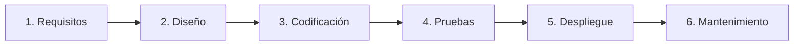
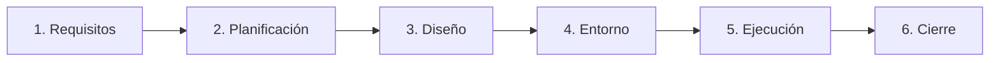

## Universidad Internacional del Ecuador
## Taller en Clase - Caja Negra
#### 7 de Septiembre del 2026
## Docente
#### Pablo Robayo
## Integrantes 
#### Gonzalo Cárdenas - Documentación y GitHub
#### Gabriel Vásquez - Tester Principal
#### Daniel Cadena - Desarrollador / Analista 

Desafío Lógico 1
Según lo investigado en ISTQB, ¿es posible que
un Defecto (Bug) exista en el código fuente de
presupuesto_analisis.py durante años sin
llegar a causar nunca un Fallo (Failure)?

-Sí, porque un defecto es una imperfección presente en el código, mientras que un fallo ocurre durante la ejecución cuando el sistema presenta un comportamiento diferente al esperado.
 Además, un bug puede permanecer oculto indefinidamente si los usuarios siempre ingresan datos ideales que no detonen el fallo.

Desafío Lógico 2
Imaginen que corrigen todos los bugs y el script
funciona perfecto, pero el cliente afirma que
"necesitaba un sistema para calcular nóminas, no
presupuestos". ¿Qué principio fundamental del
testing de ISTQB se acaba de violar aunque el
código esté limpio?

-El principio que se esta violando es el de la falacia de la ausencia de errores, el cual indica que encontrar y corregir defectos no ayuda si el sistema construido es inutilizable y no cumple con las necesidades y expectativas de los usuarios y del negocio.


## Check-list de Autoevaluación Final

Auditoría previa a la entrega final del taller:

- [x] **¿El repositorio de GitHub es estrictamente público?**  
  *Sí, configurado para acceso público sin restricciones.*
- [x] **¿Contiene el archivo `presupuesto_analisis.py` tal como fue entregado?**  
  *Sí, conservado íntegro con los 3 defectos originales para trazabilidad de pruebas.*
- [x] **¿Contiene el archivo `casos_prueba.md`?**  
  *Sí, con estructura completa de gobernanza, pruebas y diagnóstico.*
- [x] **¿El Markdown incluye evidencia (diagrama/enlace) del mapa conceptual?**  
  *Sí, diagrama formal en Mermaid y conexiones explicadas en detalle.*
- [x] **¿La tabla tiene los 3 casos ejecutados, con columna Estado y líneas de código defectuosas señaladas?**  
  *Sí, CP-01, CP-02 y CP-03 documentados con veredicto `Failed` y causa raíz identificada.*
- [x] **¿El `README.md` contiene las respuestas a los dos desafíos del cierre?**  
  *Sí, Desafíos Lógicos 1 y 2 resueltos con fundamentos técnicos formales de ISTQB.*
- [x] **¿Todos los miembros del equipo participaron y observaron cada actividad, sin importar el rol asignado?**  
  *Sí, dinámica de célula operativa QA completa de inicio a fin.*

---

# Automatización de Pruebas con PyTest y GitHub Actions


##  Conceptos Clave 

### Software Development Life Cycle (SDLC)
El **SDLC** es el proceso estructurado que guía el desarrollo y construcción de un software desde su concepción hasta su retiro. Se compone de 6 fases:



1. **Análisis de Requisitos:** Recopilación y definición de necesidades del cliente y del negocio.
2. **Diseño:** Modelado de la arquitectura del sistema, interfaces y bases de datos.
3. **Desarrollo / Codificación:** Escritura y compilación del código fuente.
4. **Pruebas:** Verificación del funcionamiento del sistema frente a los requisitos.
5. **Despliegue:** Puesta en producción y entrega del producto al usuario final.
6. **Mantenimiento:** Corrección de incidencias operativas y soporte continuo.

---

### Software Testing Life Cycle (STLC)
El **STLC** es el proceso sistemático de pruebas enfocado en la validación y aseguramiento de calidad del software. Se compone de 6 fases:



1. **Análisis de Requisitos:** Identificación de qué probar y evaluación de la testabilidad.
2. **Planificación de Pruebas:** Definición del alcance, recursos, cronograma y herramientas.
3. **Diseño de Casos:** Elaboración de casos de prueba (entradas, pasos y resultados esperados).
4. **Configuración del Entorno:** Preparación del ambiente de pruebas (runners, dependencias y datos).
5. **Ejecución de Pruebas:** Corrida de pruebas (manuales/automáticas) y reporte de defectos.
6. **Cierre del Ciclo:** Evaluación de métricas de calidad y reporte de cierre.

---


---

### Shift-Left Testing (Pruebas Tempranas)

El principio de **Shift-Left Testing** es una filosofía de ingeniería de calidad que postula mover las actividades de prueba lo más hacia la "izquierda" posible en la línea de tiempo del ciclo de desarrollo (es decir, hacia las fases iniciales de requisitos, diseño y codificación).

```
   [Izquierda / Temprano]                                      [Derecha / Tardío]
Requisitos  ->  Diseño  ->  Codificación (CI)  ->  Staging  ->  Producción
     ▲                        ▲
     │                        │
  Revisión QA           Pruebas Unitarias
  Estática              PyTest Automáticas
```

---

### Criterios de Entrada y Salida (Entry & Exit Criteria)

Para evitar la ambigüedad y garantizar la rigurosidad en los procesos de calidad, el estándar ISTQB define dos puntos de control indispensables:

#### A. Criterios de Entrada (*Entry Criteria*):
Son el conjunto de prerrequisitos formales y condiciones mínimas indispensables que deben satisfacerse antes de poder dar inicio a una fase específica de pruebas. Su propósito es impedir que el equipo malgaste tiempo intentando probar software que no está listo.


#### B. Criterios de Salida (*Exit Criteria* o *Definition of Done - DoD*):
Son el conjunto de métricas verificables, condiciones y resultados objetivos acordados previamente que determinan cuándo una fase de pruebas o un ciclo completo se puede dar por concluido con éxito.


