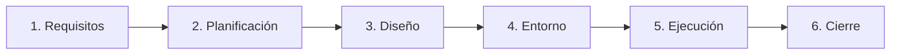

## Universidad Internacional del Ecuador
## Taller en Clase - Caja Negra
#### 7 de Septiembre del 2026
## Docente
#### Pablo Robayo
## Integrantes y Roles (Célula QA)
#### Gonzalo Cárdenas - Git Lead (Gestión de Repositorio, CI/CD y Documentación)
#### Gabriel Vásquez - Tester Principal (Diseño de Casos y Automatización con PyTest)
#### Daniel Cadena - Desarrollador / Dev (Lógica de Negocio, Análisis y Arquitectura)

Desafío Lógico 1
Según lo investigado en ISTQB, ¿es posible que
un Defecto (Bug) exista en el código fuente de
presupuesto_analisis.py durante años sin
llegar a causar nunca un Fallo (Failure)?

-Sí, porque un defecto es una imperfección presente en el código, mientras que un fallo ocurre durante la ejecución cuando el sistema presenta un comportamiento diferente al esperado.
 Además, un bug puede permanecer oculto indefinidamente si los usuarios siempre ingresan datos ideales que no detonen el fallo.

Desafío Lógico 2
Imaginen que corrigen todos los bugs y el script
funciona perfecto, pero el cliente afirma que
"necesitaba un sistema para calcular nóminas, no
presupuestos". ¿Qué principio fundamental del
testing de ISTQB se acaba de violar aunque el
código esté limpio?

-El principio que se esta violando es el de la falacia de la ausencia de errores, el cual indica que encontrar y corregir defectos no ayuda si el sistema construido es inutilizable y no cumple con las necesidades y expectativas de los usuarios y del negocio.


## Check-list de Autoevaluación Final

Auditoría previa a la entrega final del taller:

- [x] **¿El repositorio de GitHub es estrictamente público?**  
  *Sí, configurado para acceso público sin restricciones.*
- [x] **¿Contiene el archivo `presupuesto_analisis.py` tal como fue entregado?**  
  *Sí, conservado íntegro con los 3 defectos originales para trazabilidad de pruebas.*
- [x] **¿Contiene el archivo `casos_prueba.md`?**  
  *Sí, enfocado en el Caso de Prueba 01 y su trazabilidad.*
- [x] **¿El Markdown incluye evidencia (diagrama/enlace) del mapa conceptual?**  
  *Sí, diagrama formal en Mermaid y conexiones explicadas en detalle.*
- [x] **¿La tabla tiene los casos ejecutados con veredicto y causa raíz?**  
  *Sí, documentados con veredicto Failed y diagnóstico del error.*
- [x] **¿El `README.md` contiene las respuestas a los dos desafíos del cierre?**  
  *Sí, Desafíos Lógicos 1 y 2 resueltos con fundamentos técnicos formales de ISTQB.*
- [x] **¿Todos los miembros del equipo participaron y observaron cada actividad, sin importar el rol asignado?**  
  *Sí, dinámica de célula operativa QA completa de inicio a fin.*

---

# Semana 2: Automatización de Pruebas con PyTest y GitHub Actions (CI/CD)

> 📁 **Organización del Repositorio:** Los entregables y scripts de esta semana se encuentran estructurados en la raíz y replicados de forma modular en la carpeta [`/semana-2/`](./semana-2/).

---

## C1. Demostración CI/CD: Análisis del Pipeline (`.github/workflows/ci_pipeline.yml`)

El pipeline de Integración Continua se encuentra configurado en el archivo [`.github/workflows/ci_pipeline.yml`](./.github/workflows/ci_pipeline.yml) y opera de forma desatendida ante eventos de Git:

```yaml
name: PyTest CI Pipeline

on:
  push:
    branches: [ main ]
  pull_request:
    branches: [ main ]

jobs:
  test:
    runs-on: ubuntu-latest

    steps:
      - name: Descargar repositorio (Checkout)
        uses: actions/checkout@v4

      - name: Configurar entorno de Python
        uses: actions/setup-python@v5
        with:
          python-version: '3.11'
          cache: 'pip'

      - name: Instalar dependencias
        run: |
          python -m pip install --upgrade pip
          pip install -r requirements.txt

      - name: Ejecutar pruebas automatizadas con PyTest
        run: |
          python -m pytest -v
```

---


---

## C2. Mapeo del Proyecto con el STLC (ISTQB / ISO 29119) y Criterios E/S

El proceso de pruebas aplicado en este repositorio se mapea rigurosamente contra las 6 fases del **Software Testing Life Cycle (STLC)** según los estándares ISTQB e ISO/IEC/IEEE 29119:



1. **Análisis de Requisitos (Requirement Analysis):**  
   *Actividad del proyecto:* Análisis estático del código y especificación de la "Calculadora de Presupuestos" para identificar la lógica de interés mensual y particiones válidas/inválidas.
2. **Planificación de Pruebas (Test Planning):**  
   *Actividad del proyecto:* Definición del alcance del taller, selección de PyTest como motor de pruebas y adopción de GitHub Actions para el flujo CI/CD.
3. **Diseño de Casos de Prueba (Test Case Design):**  
   *Actividad del proyecto:* Elaboración de casos de prueba de caja negra (CP-01 con 0 socios, CP-02 con presupuesto negativo y CP-03 con cálculo nominal) en `casos_prueba.md`.
4. **Configuración del Entorno de Pruebas (Test Environment Setup):**  
   *Actividad del proyecto:* Creación de `requirements.txt`, `pytest.ini` y la receta virtualizada de runner Ubuntu en `.github/workflows/ci_pipeline.yml`.
5. **Ejecución de Pruebas (Test Execution):**  
   *Actividad del proyecto:* Corrida de la suite PyTest tanto en máquina local como en el runner de nube en cada `git push`, registrando capturas y el sabotaje intencional.
6. **Cierre del Ciclo de Pruebas (Test Cycle Closure):**  
   *Actividad del proyecto:* Verificación de la tasa de éxito de pruebas (100% passed), reporte final del estado del software y consolidación de la documentación en el repositorio.

### Justificación de Criterios de Entrada y Salida (E/S)

#### Criterios de Entrada (*Entry Criteria*):
1. **Disponibilidad del Código Fuente y Reglas de Negocio:**  
   *Justificación:* Es imposible diseñar o ejecutar pruebas unitarias si el script base (`presupuesto_analisis.py`) no es ejecutable o si se desconocen los parámetros de entrada requeridos (presupuesto, socios, meses).
2. **Entorno de Automatización y Dependencias Declaradas:**  
   *Justificación:* Para poder ejecutar pruebas reproducibles, el entorno debe contar con Python 3.11 instalado y el archivo `requirements.txt` con la versión compatible de `pytest>=8.0.0`.

#### Criterios de Salida (*Exit Criteria / Definition of Done*):
1. **100% de Pruebas Automatizadas Ejecutadas y Superadas:**  
   *Justificación:* Ninguna versión del software se considera apta para entrega si existen casos de prueba pendientes o fallidos sin justificación de riesgo aceptado.
2. **Pipeline de Integración Continua en Estado Exitoso (Luz Verde / Exit Code 0):**  
   *Justificación:* En un marco moderno de calidad, el criterio definitivo de aceptación de un commit es que el pipeline automatizado en GitHub Actions finalice con código de salida `0`, certificando la ausencia de regresiones en la rama principal.

---

